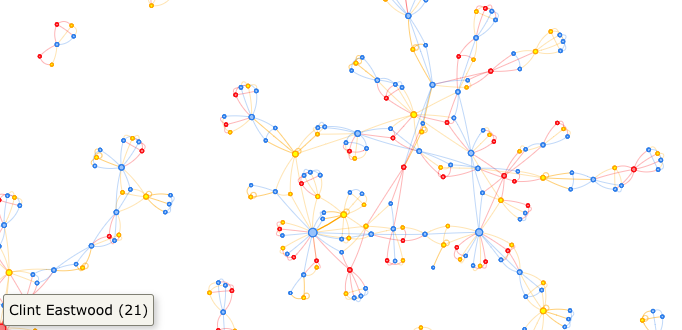

# SF Open Data Insights

## Intro

Before going straight into the code, let's check out what you'll get. The web app will provide you a lot of different insightful plots. Check a few of them out:

Visualization Networks:


Correlation Plots:


Time series Plots:


Word clouds:


## Getting Started

These instructions will get you a copy of the project up and running on your machine. In order to have the application up and running you will either have to deploy it entirely to your remote machine or part on your remote machine and part on your local machine.

### Prerequisites

You will need to install the shiny server on your remote machine. If you are running ubuntu:

```
sudo apt-get update
sudo apt-get install r-base r-base-dev gdebi-core
sudo su - -c "R -e \"install.packages('shiny', repos = 'http://cran.rstudio.com/')\""
sudo su - -c "R -e \"install.packages('rmarkdown', repos = 'http://cran.rstudio.com/')\""
wget https://download3.rstudio.org/ubuntu-12.04/x86_64/shiny-server-1.5.0.831-amd64.deb
sudo gdebi shiny-server-1.5.0.831-amd64.deb
```

For other platforms check [this reference](https://www.rstudio.com/products/shiny/download-server/).


## Deployment

Go to your local machine and run:

```
git clone https://github.com/thibalbo/sf-opendata-insights.git
cd sf-opendata-insights
sudo apt install virtualenv
virtualenv -p python3 venv
source venv/bin/activate
pip3 install -r requirements.txt
```

We will also use a local database to store our datasets. On the root directory of your project run:

```
sudo apt-get install postgresql postgresql-contrib
sudo -u postgres psql postgres
\password postgres
1234
1234
create database sf_opendata_insights
\q


mkdir db
/usr/lib/postgresql/9.5/bin/initdb -D db
/usr/lib/postgresql/9.5/bin/pg_ctl -D db -l logfile start

/usr/lib/postgresql/9.5/bin/createdb
```

Before running the application, go to the file config.yml and insert your instance DNS there. Then run the setup file

```
python3 setup.py
```

It will create tables, download the datasets and scrape new content (that might take a couple minutes).

After that, simply run the application with:

```
python3 run.py
```


## Built With

* [Flask](http://flask.pocoo.org/) - The web framework used

## Contributing

The best way is to send a pull request.
